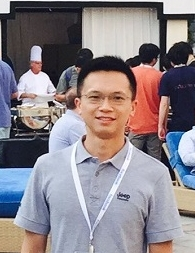

I am a postdoctoral researcher in [Computer Vision Lab](https://cvlab.epfl.ch) of [EPFL](https://www.epfl.ch/),
collaborated with [Pascal Fua](http://people.epfl.ch/pascal.fua) and [Mathieu Salzmann](http://people.epfl.ch/mathieu.salzmann). The research areas that I involved and
interested include optical flow, motion analysis, and object pose
estimation. In 2017, I completed my Ph.D. degree from Xidian
University, China. Before that, I worked as a senior algorithm engineer and
technical leader in Zienon, LLC.

[GoogleScholar](https://scholar.google.com/citations?user=dhmdaoQAAAAJ&hl=en), [GitHub](http://github.com/yinlinhu)

<!-- [CV](/files/cv.pdf) -->

[huyinlin@gmail.com](mailto:huyinlin@gmail.com)

{:.border.rounded}

# News
* `03.2019` Our paper is accepted to CVPR 2019. 
* `07.2018` Our paper is accepted to ECCV 2018. 
* `01.2018` I join CVLab of EPFL in Switzerland as a postdoctoral researcher.
* `12.2017` I pass the oral defence of my Ph.D dissertation.
* `12.2017` Our paper is accepted to IVC.
* `05.2017` Our paper is accepted to T-CSVT.
* `03.2017` Our paper is accepted to CVPR 2017. (in [OpenCV](https://opencv.org/) now)
* `10.2016` I am elected as the 'Outstanding Ph.D. Candidate' of Xidian University.
* `08.2016` I win the 'Doctoral National Scholarship 2016' of China.
* `02.2016` Our paper is accepted to CVPR 2016. (**spotlight**)
* `01.2016` I get married with my wife who gives me all her encouragement. 
* `10.2015` Our paper is accepted to IVC.
* `09.2014` I leave Zienon and start to pursue a Ph.D. degree at Xidian University.
* `02.2013` I become the team leader of the development group.
* `06.2012` I get the 'Outstanding Contribution Award' of Zienon.
* `01.2012` Our demo 'AirGenie' is regarded as the 'Best of Show' of CES 2012 in USA.
* `06.2011` I join Zienon, LLC as an algorithm engineer.
* `04.2011` I get my MA.Sc degree from Xidian University.

# Publications

* **Yinlin Hu**, Joachim Hugonot, Pascal Fua, Mathieu Salzmann. Segmentation-driven 6D Object Pose Estimation. IEEE Conference on Computer Vision and Pattern Recognition (CVPR), 2019. [\[Code\]](https://github.com/cvlab-epfl/segmentation-driven-pose)
* Zheng Dang, Kwang Moo Yi, **Yinlin Hu**, Fei Wang, Pascal Fua, Mathieu Salzmann. Eigendecomposition-Free Training of Deep Networks with Zero Eigenvalue-Based Losses. European Conference on Computer Vision (ECCV), pp. 792-807, 2018 [\[Code\]](https://github.com/Dangzheng/Eig-Free-release)
* **Yinlin Hu**, Yunsong Li, Rui Song, Peng Rao, Yangli Wang. Minimum barrier superpixel segmentation. Image Vision Computing. Vol. 70, pp. 1-10, 2018 [\[Code\]](https://github.com/YinlinHu/MBS)
* Yunsong Li, **Yinlin Hu**, Rui Song, Peng Rao, Yangli Wang. Coarse-to-Fine PatchMatch for Dense Correspondence. IEEE Transactions on Circuits System and Video Technique. Vol. 28, Nr. 9, pp. 2233-2245, 2018 [\[Code\]](https://github.com/YinlinHu/CPM)
* **Yinlin Hu**, Yunsong Li, Rui Song. Robust Interpolation of Correspondences for Large Displacement Optical Flow. IEEE Conference on Computer Vision and Pattern Recognition (CVPR), pp. 4791-4799, 2017 [\[Code\]](https://github.com/YinlinHu/Ric)
* **Yinlin Hu**, Rui Song, Yunsong Li, Peng Rao, Yangli Wang. Highly accurate optical flow estimation on superpixel tree. Image Vision Computing, Vol. 52, pp. 167-177, 2016
* **Yinlin Hu**, Rui Song, Yunsong Li. Efficient Coarse-to-Fine Patch Match for Large Displacement Optical Flow. IEEE Conference on Computer Vision and Pattern Recognition (CVPR), pp. 5704-5712, 2016 [\[Code\]](https://github.com/YinlinHu/CPM)
